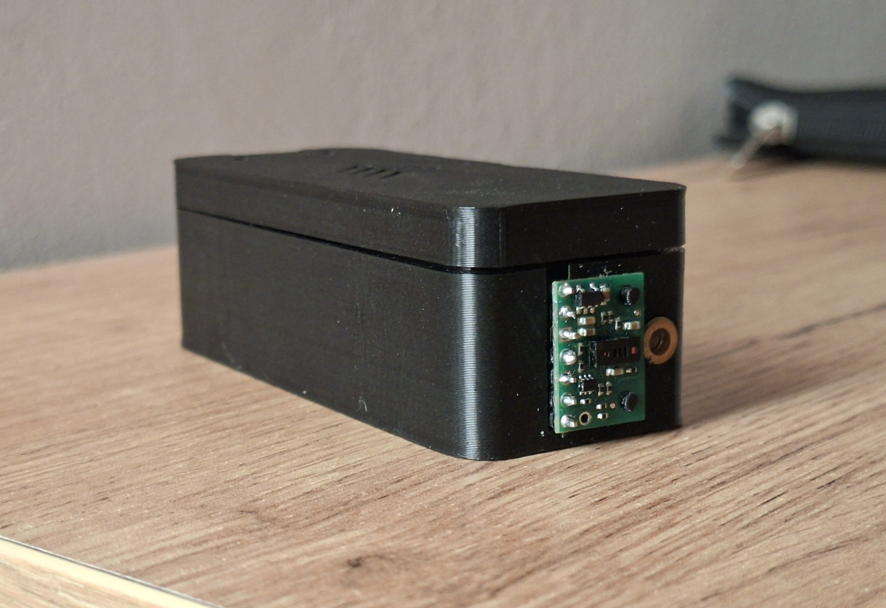

# 🖐️ ESP32 Edge AI Gesture Controller & BLE HID

A completely touchless Human Interface Device (HID) built with an ESP32 and a VL53L5CX 8x8/4x4 Multizone Time-of-Flight (ToF) sensor. The system uses a Convolutional Neural Network (CNN) trained via Edge Impulse to recognize hand gestures and translates them into Bluetooth Low Energy (BLE) keyboard commands.

## 🚀 Key Features

* **Multizone ToF Mapping:** Utilizes the VL53L5CX sensor to create a low-resolution spatial depth map at 60Hz.
* **Hybrid Architecture:** Combines deep learning (CNN) for directional gestures (Swipe Left/Right) with raw mathematical bypass logic for static gestures (Hold, Push) to eliminate overfitting and reduce latency.
* **BLE Presentation Mode:** Emulates a wireless keyboard (Plug & Play) mapping gestures to media/presentation controls (e.g., Next Slide, Laser Pointer toggle).
* **Live Telemetry:** Streams real-time `D:` (Distance) and `G:` (Gesture) frames over Serial for real-time 3D visualization in LabVIEW.

## 🛠️ Hardware Setup
* **Microcontroller:** ESP32 Development Board (Dual-core)
* **Sensor:** ST VL53L5CX Time-of-Flight Multizone Ranging Sensor
* **Wiring (I2C):** SDA -> GPIO 21, SCL -> GPIO 22

## 🧠 Machine Learning Pipeline
The gesture recognition model was developed using [Edge Impulse](https://www.edgeimpulse.com/).
1. **Data Acquisition:** 16-zone distance data streamed directly to the Edge Impulse studio.
2. **Processing:** 800ms Sliding Window with 16ms shifts.
3. **Model:** 1D Convolutional Neural Network (CNN).
4. **Optimization:** INT8 Quantization for massive RAM/Flash reduction, achieving < 10ms inference time on the ESP32.

## ⚙️ How to use
1. Install the required libraries in your Arduino IDE (see *Dependencies* below).
2. Include your specific Edge Impulse exported Arduino Library.
3. In Arduino IDE, change the Partition Scheme to **Huge APP (3MB No OTA)** to fit both the Neural Network and the BLE stack.
4. Flash the code to your ESP32.
5. Connect your PC/Mac via Bluetooth to the "Czujnik Gestow" device.

## 📚 Dependencies / Credits
This project wouldn't be possible without these fantastic tools and libraries:
* Machine Learning pipeline built with [Edge Impulse](https://www.edgeimpulse.com/).
* ToF sensor integration via [SparkFun VL53L5CX Library](https://github.com/sparkfun/SparkFun_VL53L5CX_Arduino_Library).
* BLE HID functionality powered by [ESP32 BLE Keyboard](https://github.com/T-vK/ESP32-BLE-Keyboard) by T-vK.
* System Architecture & Hybrid Logic implemented by Dominik Majchrowicz.
* Electronics & Hardware Integration by [Bartosz Kozielec](https://github.com/BKozielec).

## 📄 License
This project is licensed under the MIT License - see the LICENSE file for details.
